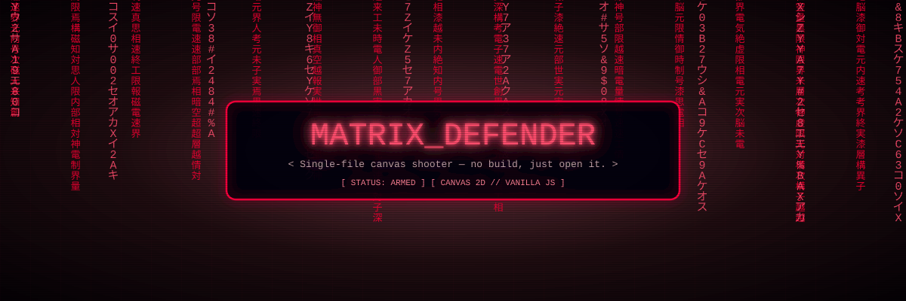
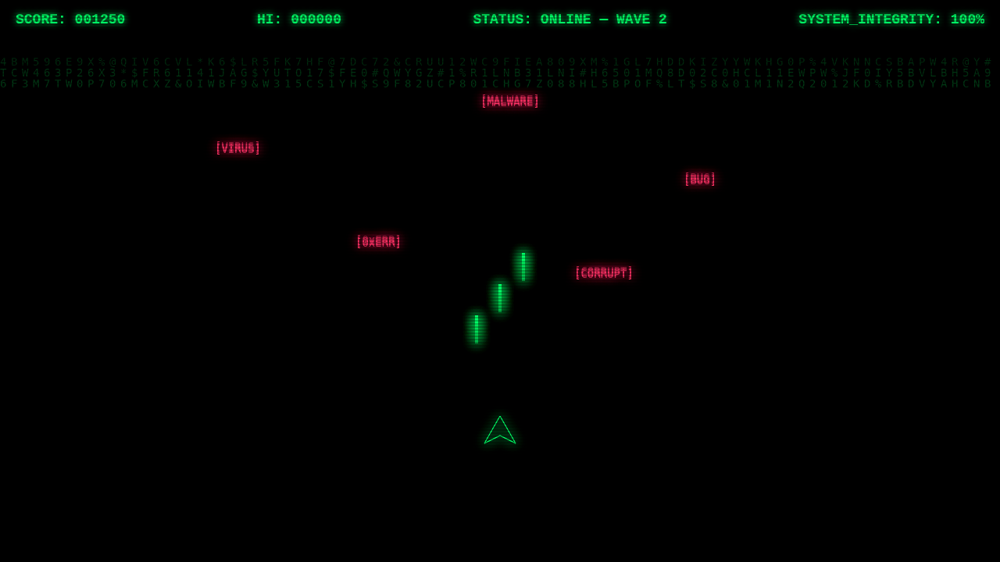

<div align="center">
  
</div>

# MATRIX_DEFENDER // rv2hex

A single-file Matrix-themed space shooter. No build step, no dependencies —
just open it in a browser. Defend the grid against falling malware.



## Play

Open `index.html` in any modern browser, or serve the folder:

```sh
python3 -m http.server 8000
# then visit http://localhost:8000
```

## Controls

| Input | Action |
|---|---|
| `←` / `→` or `A` / `D` | Move ship |
| `Space` / `↑` / `W` | Shoot |
| `Space` (on game-over screen) | Reboot system (restart) |

## Rules

- Enemies (`VIRUS`, `CORRUPT`, `0xERR`, `MALWARE`, `BUG`) rain from the top,
  kill = **+100 score**.
- Anything that slips past the bottom line costs **15% system integrity**.
- At 0% integrity: `CRITICAL_SYSTEM_FAILURE`. Press Space to reboot.
- **Difficulty ramp:** a new wave every ~20s — spawns get faster (90 → 22
  frames), enemies get quicker (1.2 → 4.2 speed), and tougher (1 HP on wave
  1, 2 HP from wave 2, 3 HP from wave 5). Current wave shows in the HUD.
- **High score** persists in `localStorage`, shows live in the HUD, and the
  game-over screen calls out `** NEW RECORD **` runs.

## Structure

```
index.html   everything: Matrix-rain canvas backdrop, HUD
             (score / status / integrity), scanline overlay,
             game loop (player, bullets, enemies, particles)
```

Canvas 2D only; game state resets on page reload (no persistence).
